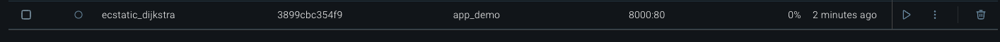

## Meron Gedrago mini project week 12

[](https://github.com/nogibjj/Meron_Gedrago_mini_Week12/actions/workflows/build.yml)

## Structure for this project 

```
├── .devcontainer/
│   ├── devcontainer.json
│   └── Dockerfile
├── .github/
│   └── workflows/
│        └──build.yml
├── app.py
├── .gitignore
├── visuals
├── requirements.txt
├── Makefile
├── README.md
└── Dockerfile

```
## Purpose of the project  

This project aims to create a flask application using Dockerfile. I have created an application that takes a number and decides whether or not the number is prime.  


### Demo of the app:

**Setup and run locally:**

1. To test the app locally, run the following code in the terminal 

> flask run 


2. Copy and paste the link the above output and put into a search engine, then it takes us to the application 


**Demo website:**

1. Check whether or not the app works well and test it with numbers that are prime and not prime 


2. We see the requests coming in from our terminal as we interact with the application 


**Dockerhub output:**


1. Since we now know that the app works, we can push to docker hub by running 

> make run


2. Check on dockerhub if the image has been created 



3. Test if the image is pulled (you can change your enviroment where you don't have flask installed and try the app) by running the following 

> docker pull merongedrago/app_demo:latest


